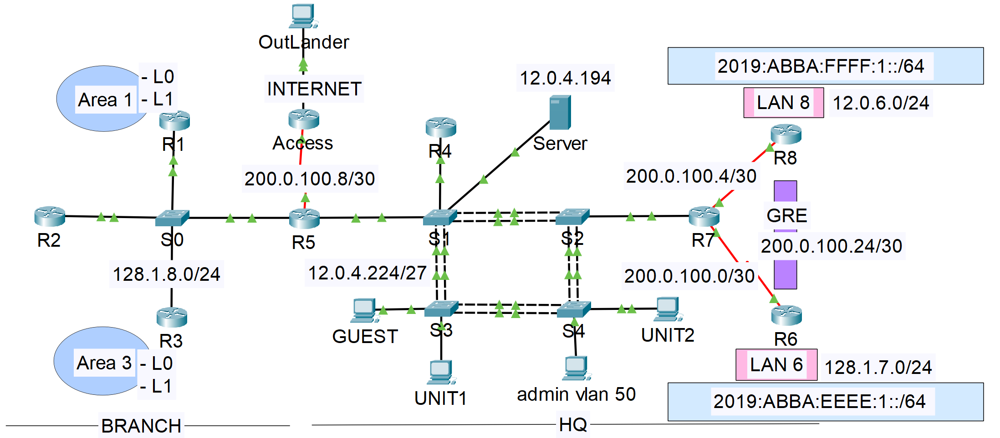

### Giới thiệu
**Tác giả:** Võ Mạnh Cường – MSSV: 52200319  
**Biệt danh:** Chooky  
**Lớp:** 22050401 – Khoa Công nghệ Thông tin  
**Trường Đại học Tôn Đức Thắng**  
**Môn học:** Mạng máy tính nâng cao 
**Giảng viên hướng dẫn:** ThS. Lê Viết Thanh  
**Ngày hoàn thành:** 13/05/2025  

---
## 🧭 Tổng quan

Dự án này trình bày quá trình **thiết kế, cấu hình và kiểm thử một hệ thống mạng doanh nghiệp tích hợp song song IPv4 và IPv6**, nhằm đáp ứng các yêu cầu về:

- Định tuyến nội bộ với **EIGRP (HQ)** và **OSPF (Branch)**
- Chuyển mạch đa tầng với **VLAN, VTP, EtherChannel, Rapid PVST+**
- Liên kết WAN với **PPP (PAP/CHAP)** và **GRE Tunnel**
- Dịch vụ mạng: **NAT, DHCP, ACL**
- Địa chỉ hóa và định tuyến **IPv6**, cùng **DHCPv6**
- Quản trị an toàn bằng **SSH**

Mục tiêu là tạo ra **một hệ thống mạng doanh nghiệp mô phỏng đầy đủ chức năng**, đảm bảo **ổn định, bảo mật, dễ mở rộng và hỗ trợ cả IPv4/IPv6**.

---

## 🗺️ Kiến trúc hệ thống

  

Hệ thống được chia làm hai khu vực chính:

### 🏢 Trụ sở chính (HQ)
- Các router: **R4, R6, R7, R8**
- Các switch: **S1–S4**
- Định tuyến: **EIGRP (AS 100)**  
- Dịch vụ mạng: **NAT, DHCP, ACL, SSH**
- VLANs: 10 (UNIT1), 20 (UNIT2), 30 (UNIT3), 40 (GUEST), 50 (SERVERS), 60 (Management)
- Liên kết giữa router–switch thông qua **Router-on-a-Stick**

### 🏬 Chi nhánh (Branch)
- Router: **R1, R2, R3, R5**
- Định tuyến: **OSPF đa khu vực**
- R5: Router biên kết nối HQ ↔ Internet
- Có **redistribution giữa OSPF và EIGRP**, chia sẻ tuyến giữa hai khu vực.

---
## ⚙️ Các công nghệ và kỹ thuật chính

| Thành phần | Mô tả |
|-------------|-------|
| **Định tuyến IPv4** | EIGRP tại HQ, OSPF đa khu vực tại chi nhánh, redistribution tại R5 |
| **Định tuyến IPv6** | EIGRP for IPv6, static default route, inter-VLAN routing |
| **Chuyển mạch** | VLAN, VTP Server/Client, EtherChannel, Rapid-PVST+ |
| **WAN** | PPP (PAP/CHAP), GRE Tunnel giữa R6–R8 |
| **Dịch vụ mạng** | NAT Overload, DHCPv4, DHCPv6, ACL bảo mật |
| **Quản trị** | SSH, Access Control List, hostname và domain riêng |
| **Prefix IPv6** | `2019:ABBA:CDDC::/48` chia /64 cho từng VLAN |
| **Thiết bị mô phỏng** | Router Cisco ISR4321, Switch Cisco IOS2960 |

---

### Hướng dẫn sử dụng báo cáo và file cấu hình

Báo cáo mô tả chi tiết **thiết kế, phân bổ địa chỉ, cấu hình và kết quả kiểm thử**.  

File cấu hình Packet Tracer (pkt) đi kèm chứa mô hình mạng tương ứng, bao gồm các router, switch, và thiết bị khác, được thiết lập dựa trên các phần đã mô tả trong báo cáo.

### Nội dung file cấu hình
- **Tên file**: [configuration.pkt].
- **Phiên bản Packet Tracer**: Được tạo và kiểm tra trên Packet Tracer phiên bản 8.2.2.
- **Cấu hình chính**:
  - Kết nối PPP giữa các router.
  - Thiết lập GRE tunnel.
  - Định tuyến với OSPF (chi nhánh) và EIGRP (HQ).
  - Chuyển mạch với VLAN, VTP, Rapid PVST+, và EtherChannel.
  - NAT, DHCP, và ACL cho IPv4.
  - Cấu hình địa chỉ, định tuyến EIGRPv6, và DHCPv6 cho IPv6.
- **Thiết bị**: Bao gồm các router (R1-R8, ACCESS) model cisco ISR4321, switch (S0-S4) model cisco IOS2960, và các host trong các VLAN.

### Hướng dẫn sử dụng
1. **Mở file**: Sử dụng Packet Tracer để mở file pkt. Đảm bảo phiên bản phần mềm tương thích.
2. **Kiểm tra cấu hình**:
   - Vào chế độ CLI trên từng thiết bị (router, switch) để xem các lệnh cấu hình bằng cách nhập `show running-config`.
   - Kiểm tra kết nối bằng lệnh `ping` giữa các thiết bị (ví dụ: từ R4 đến R5).
   - Xem bảng định tuyến với `show ip route` (IPv4) hoặc `show ipv6 route` (IPv6).
3. **Xem lệnh cấu hình chi tiết**:
   - Mở thư mục "Commands" đi kèm để tham khảo các file lệnh cấu hình chi tiết, bao gồm:
     - IPv4_ACL.txt: Cấu hình ACL cho IPv4.
     - IPv4_Configuration.txt: Cấu hình tổng quát IPv4.
     - IPv4_NAT_DHCP.txt: Cấu hình NAT và DHCP cho IPv4.
     - IPv4_PPP_GRE.txt: Cấu hình PPP và GRE.
     - IPv4_Routing.txt: Cấu hình định tuyến IPv4.
     - IPv6_Configuration.txt: Cấu hình tổng quát IPv6.
     - IPv6_DHCP.txt: Cấu hình DHCPv6.
     - IPv6_Routing.txt: Cấu hình định tuyến IPv6.
   - Các file này chứa các lệnh được áp dụng trên từng thiết bị, được lưu lại vào ngày 11/05/2025.
4. **Thử nghiệm**:
   - Kiểm tra NAT bằng cách truy cập Internet từ host trong VLAN.
   - Xác nhận DHCP/DHCPv6 bằng cách kiểm tra địa chỉ IP được cấp cho host.
   - Thử truy cập bị chặn bởi ACL để kiểm tra hiệu quả.
   - **NAT:** ping từ host nội bộ ra Internet.
   - **DHCP:** kiểm tra host có nhận IP động.
   - **ACL:** thử truy cập từ VLAN bị chặn (ví dụ: GUEST) → xác minh giới hạn truy cập.
   - **SSH:** kết nối quản trị thiết bị từ VLAN SERVERS.

---
## 📈 Kết quả và hướng mở rộng

### ✅ Kết quả đạt được
- Hệ thống hoạt động ổn định, định tuyến và NAT chính xác.
- DHCP/DHCPv6 cấp phát IP tự động cho các VLAN.
- GRE Tunnel giữa R6–R8 đảm bảo kết nối xuyên vùng.
- ACL kiểm soát truy cập hiệu quả, đảm bảo tính bảo mật.
- Mô hình dễ dàng mở rộng sang các dịch vụ khác như Web, DNS, VPN.

### 🚀 Hướng phát triển
- Triển khai **IPSec VPN** bảo mật đường hầm GRE.
- Tối ưu **QoS** và **Load Balancing** giữa các router.
- Mở rộng kết nối tới **Cloud/Datacenter mô phỏng**.
- Tự động hóa cấu hình với **Python (Netmiko/NAPALM)**.

---
### Lưu ý
- Đảm bảo tất cả các thiết bị trong mô hình được bật nguồn (Power On) trước khi kiểm tra.
- Nếu gặp lỗi, kiểm tra lại kết nối cáp và trạng thái interface (lệnh `show ip interface brief`).
- Các file trong thư mục "Commands" chỉ mang tính tham khảo, không thay thế cấu hình trực tiếp trên Packet Tracer. Vui lòng đối chiếu với mô hình pkt để đảm bảo tính chính xác.
- Báo cáo đi kèm cung cấp chi tiết về từng bước cấu hình và kết quả đạt được, vui lòng tham khảo để đối chiếu.

### Bản quyền
Bản báo cáo và file cấu hình này thuộc bản quyền của Võ Mạnh Cường - Copyright © Chooky. Mọi sao chép, phân phối hoặc sử dụng trái phép đều không được phép mà không có sự đồng ý bằng văn bản từ Võ Mạnh Cường.

### Thông tin liên hệ
- Tác giả: [Võ Mạnh Cường] AKA [Chooky].
- Mã số sinh viên: [52200319]
- Ngày hoàn thành: 13 tháng 5 năm 2025.
- Phản hồi: [vmcchooky@gmail.com],
            [facebook.com/chooky.vmc].
